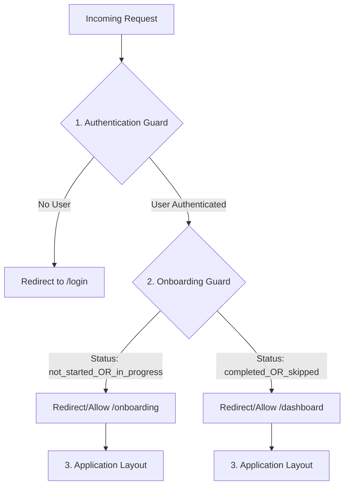

# ONBOARDING ROUTING SPECIFICATION

> **STATUS:** DRAFT
> **SCOPE:** Frontend Routing Architecture
> **DEPENDENCIES:** `docs/ONBOARDING_CONTRACT.md`, `docs/ONBOARDING_STATE_MACHINE.md`

---

## 1. ARCHITECTURE OVERVIEW

The application routing is composed of three distinct layers of protection.
Each layer must pass before the next is evaluated.



---

## 2. ROUTE DEFINITIONS

| Path          | Access Level                    | Description                                                 |
| :------------ | :------------------------------ | :---------------------------------------------------------- |
| `/login`      | Public                          | Entry point for unauthenticated users.                      |
| `/onboarding` | Protected (**Strict**)          | The ONLY route for users in `not_started` or `in_progress`. |
| `/dashboard`  | Protected (**Post-Onboarding**) | The primary route for users in `completed` or `skipped`.    |
| `/*` (Other)  | Protected                       | All other application routes behave like `/dashboard`.      |

---

## 3. GUARD LOGIC (PSEUDOCODE)

This logic runs on **EVERY** page navigation or initial load.
It assumes `auth` is already resolved.

```typescript
function OnboardingGuard(user: User, currentPath: string) {
  // 1. Resolve State (incorporating Refresh Safety)
  // This calls the fail-open logic defined in STATE_MACHINE.md
  const status = getSafeOnboardingState(user);

  // 2. Define Route Segments
  const ONBOARDING_PATH = "/onboarding";
  const DASHBOARD_PATH = "/dashboard";
  const isTryingToOnboard = currentPath.startsWith(ONBOARDING_PATH);

  // 3. CASE A: User is "New" or "Active" in Onboarding
  if (status === "not_started" || status === "in_progress") {
    // If they are NOT on the onboarding page, force them there.
    if (!isTryingToOnboard) {
      return Redirect(ONBOARDING_PATH);
    }
    // If they ARE on the onboarding page, allow it.
    return Allow();
  }

  // 4. CASE B: User is "Done" (Completed or Skipped)
  if (status === "completed" || status === "skipped") {
    // If they try to go back to onboarding, kick them out.
    if (isTryingToOnboard) {
      return Redirect(DASHBOARD_PATH);
    }
    // Allow all other processing (Application Guards take over from here)
    return Allow();
  }

  // 5. SAFETY FALLBACK (Should be unreachable if types are strict)
  // If status is unknown, treat as 'skipped'/done to avoid blocking.
  return Allow();
}
```

---

## 4. REDIRECT MATRIX

This table defines the **deterministic** outcome for every user state and route combination.

| Onboarding Status | Target Route  | Outcome (Action)              | Reason                                  |
| :---------------- | :------------ | :---------------------------- | :-------------------------------------- |
| **`not_started`** | `/onboarding` | **Allow**                     | Standard entry.                         |
| **`not_started`** | `/dashboard`  | **Redirect** -> `/onboarding` | User must attempt onboarding first.     |
| **`not_started`** | `/settings`   | **Redirect** -> `/onboarding` | User must attempt onboarding first.     |
| **`in_progress`** | `/onboarding` | **Allow**                     | User is actively onboarding.            |
| **`in_progress`** | `/dashboard`  | **Redirect** -> `/onboarding` | Cannot leave until finished or skipped. |
| **`completed`**   | `/onboarding` | **Redirect** -> `/dashboard`  | **NEVER** show onboarding again.        |
| **`completed`**   | `/dashboard`  | **Allow**                     | Standard access.                        |
| **`skipped`**     | `/onboarding` | **Redirect** -> `/dashboard`  | **NEVER** show onboarding again.        |
| **`skipped`**     | `/dashboard`  | **Allow**                     | Standard access.                        |

---

## 5. INITIALIZATION & REFRESH SAFETY

The logic relies heavily on `getSafeOnboardingState()`.
When the app initializes (e.g., full page reload):

1.  **Auth Context** initializes -> User is found.
2.  **Onboarding Logic** checks `persistence`.
    - If `localStorage` says `in_progress` AND this is a new session/refresh:
    - `getSafeOnboardingState()` **MUST return `skipped`**.
3.  **Routing Guard** sees `skipped`.
4.  **Action:** Redirects user to `/dashboard`.

**Result:** A user who refreshes during Step 2 of onboarding is immediately routed to the Dashboard. Rules are satisfied.

---

## 6. IMPLEMENTATION NOTES

- **No Flashing:** The Guard must render `null` or a loading spinner while determining the redirect. It must NOT render the `Children` (Page Content) until `Allow()` is returned.
- **Performance:** The check is synchronous (memory/localStorage). It should not cause visible delay.
- **Middleware vs Component:**
  - If using **Next.js Middleware**: `currentPath` is available in `request`. `localStorage` is NOT available. In this specific stack, if `localStorage` is the source of truth for "active" state, this logic often lives in a Client-Side Context Provider (`OnboardingGuard` component) wrapping the app.
  - **Recommendation:** Implement as a Client-Side Auth Wrapper component that sits _inside_ the AuthProvider but _outside_ the Layout/Page.

```tsx
// Example Component Structure
<AuthProvider>
  <OnboardingGuard>  <-- LOGIC LIVES HERE
    <Layout>
      <Page />
    </Layout>
  </OnboardingGuard>
</AuthProvider>
```
